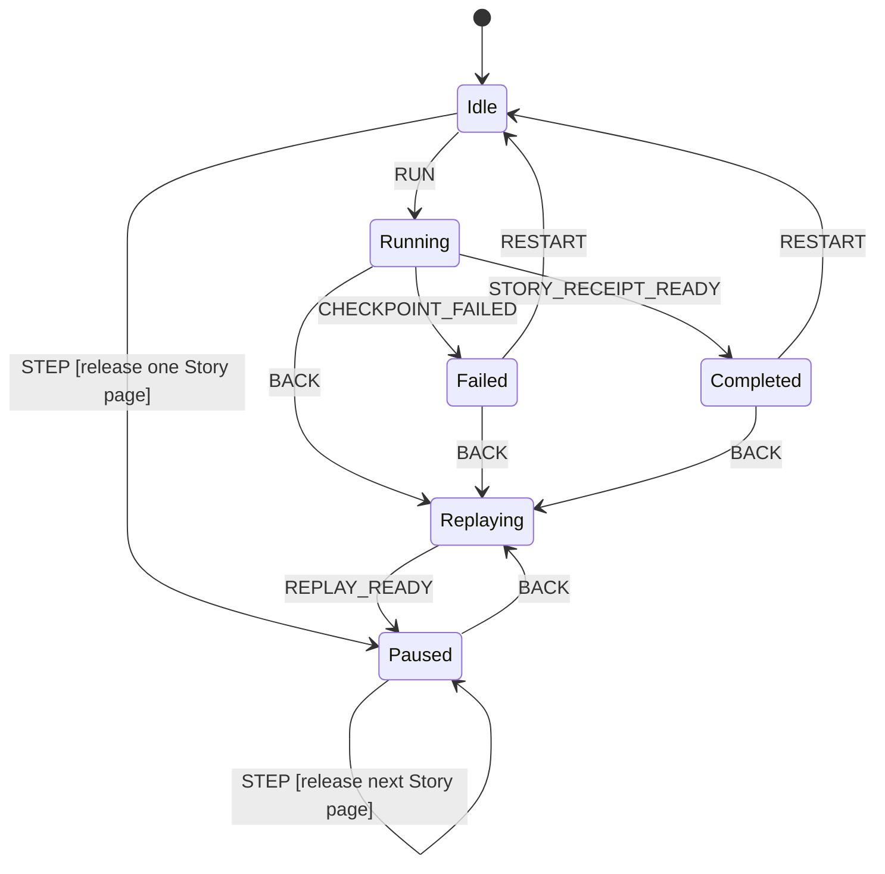

# Ignite Alchemy Narrative and Machine Matrix

Status: narrative gate before further visual iteration
Recorded: 2026-07-21
Task: `direct-1784661171192` / `task-1784655399770`

## Ownership and boundary table

| Concern | Authority/source of truth | Functional core | Imperative shell/adapter | Projection/UI |
| --- | --- | --- | --- | --- |
| Executable Story page order and receipt | `igniteTest({ component }).story(...)` | page semantics, checkpoint names, and final receipt truth stay in Story source | fixture setup, callback execution, teardown | reviewer shell may reveal and sequence, never replace |
| Voice Workbench session lifecycle | `voiceWorkbenchSessionMachine` | actor-owned lifecycle and derived views | actor startup, subscriptions, disposal | reviewer reads state-derived facts only |
| Model turn, voice capture, and speech delivery | real child machines | authorization, timeout, cancellation, and delivery facts | controlled ports and host adapters | additive evidence only |
| Reviewer stepping and replay controller | future Ignite Alchemy host controller | page cursor, replay equivalence, and control policy | dispose, rebuild, replay, optional lens join | primary reviewer shell |
| Optional XState lens | future additive observation join | exact / candidate / unavailable certainty policy | observation installation | Machine tab only |
| Coverage and gap review | future coverage join | uncovered / excluded classification | report assembly | additive review surfaces only |

## Lifecycle disposition gate

| Workflow/lifecycle | Disposition | Single authority | Evidence | Required action |
| --- | --- | --- | --- | --- |
| Executable Story page / checkpoint truth | implemented execution contract | existing Story executor | `workbench-narratives.test.ts` named stories | retain as canonical initial design truth |
| Voice Workbench parent session | explicit machine | `voiceWorkbenchSessionMachine` | `src/session.graph.test.ts`, `src/session.headless.test.ts`, README topology | retain and cite |
| Model turn child | explicit machine | `modelTurnMachine` | `src/model-turn.graph.test.ts` | retain and cite |
| Voice capture child | explicit machine | `voiceCaptureMachine` | `src/voice.graph.test.ts` | retain and cite |
| Speech delivery child | explicit machine | `speechDeliveryMachine` | `src/speech.graph.test.ts` | retain and cite |
| Reviewer Story stepping / Back replay | designed controller lifecycle | future Ignite Alchemy host controller | queued controller / POC tasks | design only; do not claim implementation |
| Optional XState evidence joins | policy-or-effect facts | future lens join | architecture task plus queued follow-up | design only; fail closed when unavailable |
| Coverage join and gap review | reducer-owned / policy facts | future coverage projection | architecture task plus queued follow-up | design only; additive only |

## Canonical executable Story seeds

| Story ID | Story name | Implemented subject truth | Named checkpoints | Commands | Final view truth | Why it matters to design |
| --- | --- | --- | --- | --- | --- | --- |
| `STORY-001` | `preparation failure retries into ready` | retry from failed preparation into ready state | `ready after retry` | `beginModelPreparation` | `status: "ready"`, `model.status: "available"` | simplest pass and clean receipt |
| `STORY-002` | `microphone permission denial recovers to typed prompt` | permission denial remains visible while typed recovery starts a new turn | `voice permission stays a fact`, `text recovery starts a new turn` | `startVoiceCapture`, `submitPrompt` | `status: "responding"`, `voiceState: "permission"` | golden walkthrough recommendation |
| `STORY-003` | `timed out turn retries to an accepted response` | timeout returns idle, retry creates artifact, accepted completion returns ready | `timeout returns the turn to idle`, `retry can finish with an accepted artifact`, `accepted retry returns to ready` | `submitPrompt`, `createArtifact`, `completeResponse` | `status: "ready"`, accepted response text, artifact revision `1` | timeout and ordinary completion |
| `STORY-004` | `stale correlated model receipts stay inert until the live turn ends` | stale first-turn result never mutates the live second turn | `cancelled first turn returns idle`, `second turn is responding`, `stale port result stays inert`, `live correlation still controls exit` | `submitPrompt` plus actor-owned cancel events | only the live turn controls return to ready | advanced stale-suppression evidence |

## Subject Story to reviewer-journey mapping

| Subject Story truth | Reviewer shell obligation | Allowed shell behavior | Forbidden shell behavior | Maturity |
| --- | --- | --- | --- | --- |
| Given / Intent / Behavior / Checkpoint pages are named and ordered by the Story source | reveal the same page phases literally | step one page at a time or run all remaining pages | rename phases, merge away checkpoint identity, or invent mock domains | designed |
| `canExecute` outcomes at each checkpoint come from the Story receipt | show command availability before / after each page | present controls as enabled / disabled / deferred | infer availability from layout convenience | designed |
| final receipt remains ordinary Story truth | keep receipt primary at completion or failure | show additive context, Machine, or Coverage tabs secondarily | replace the ordinary receipt with a topology-first explanation | designed |
| stale and unavailable evidence may exist | explain them honestly | candidate / unavailable language, optional Machine tab, no-lens fallback | manufacture exact causal confidence | designed |
| Back is not part of Story source | host may offer deterministic replay to a prior page | dispose, rebuild, replay from fresh fixture | mutate snapshots in place or fake rewind | designed |

## Golden walkthrough and bounded variants

| Flow ID | Source Story | Reviewer goal | Distinctive proof | Rejoin / terminal | Maturity |
| --- | --- | --- | --- | --- | --- |
| `FLOW-GOLDEN` | `STORY-002` | recover from microphone denial to typed prompt | permission fact survives into the responding turn | terminal pass into ordinary receipt review | designed over implemented Story |
| `FLOW-FAIL-CHECKPOINT` | `STORY-002` variant | diagnose a regression on the same story path | failed checkpoint auto-opens Debug first | recover via Back or Restart | designed |
| `FLOW-NO-LENS` | `STORY-002` or `STORY-001` | complete review without topology proof | explicit `No XState lens` message while Story truth stays intact | rejoins same Story review | designed |
| `FLOW-BACK-REPLAY` | prior page in `FLOW-GOLDEN` | move to a prior page without in-place rewind | dispose / rebuild / replay is explicit | rejoins restored prior page | designed |
| `FLOW-STALE-EVIDENCE` | `STORY-004` | prove stale evidence stays inert | stale receipt never becomes active application truth | terminal pass after live turn exits | designed over implemented Story |

## Machine-validation receipts already supporting the design

| Machine / contract | Maturity | Evidence | Design implication |
| --- | --- | --- | --- |
| `voiceWorkbenchSessionMachine` | implemented | `src/session.graph.test.ts`, `src/session.headless.test.ts`, README topology | parent session lifecycle and supervision are already authoritative |
| `modelTurnMachine` | implemented | `src/model-turn.graph.test.ts` | timeout, cancellation, stale-result correlation, and accepted completion already have machine truth |
| `voiceCaptureMachine` | implemented | `src/voice.graph.test.ts` | microphone permission denial is real behavior, not a design invention |
| `speechDeliveryMachine` | implemented | `src/speech.graph.test.ts` | speech evidence remains additive and actor-owned |
| Story execution contract in `workbench-narratives.test.ts` | implemented | exact named stories, commands, pages, and checkpoints | reviewer shell must preserve page-by-page Story truth literally |

## Designed reviewer controller contract

The reviewer controller is still a designed host-product machine, not current
implemented truth. It exists only to sequence review around the authoritative
Story executor.

| State/value | Accepted events | Public controls | Guard/policy | Effect/adapter | Emitted fact | Read model |
| --- | --- | --- | --- | --- | --- | --- |
| idle | select-story, run, step | Story picker, Run, Step | Story must be selected | fresh fixture bootstrap | selected Story and initial page truth | selected Story summary |
| running | story-page-released, checkpoint-failed, story-receipt-ready, back | Run, Back | preserve Story page order and receipt truth | gated Story execution | current page, current checkpoint status | application preview + progress lane |
| paused | step, run, back | Step, Run, Back | one page per Step | host sequencing only | paused page boundary | page-by-page review |
| replaying | replay-ready | Back disabled until replay completes | dispose, rebuild, replay from fresh fixture | fixture teardown and reconstruction | restored prior page | replay status |
| completed | back, restart, open-receipt, open-machine, open-coverage | Back, Restart, Debug tabs | ordinary receipt stays primary | additive evidence joins only | final Story receipt | receipt-first completion surface |
| failed | back, restart, open-debug | Back, Restart, Debug tabs | failed checkpoint remains first Debug target | additive evidence joins only | failed checkpoint + ordinary receipt | failure-first review surface |

Maturity note:

- Story/page truth above is implemented.
- Host-product stepping, Back replay, and optional lens joins remain designed
  until the queued controller and POC tasks land.

## Traceability from executable truth to reviewer pages

| Reviewer flow/page | Subject Story page source | Reviewer-visible application outcome | Checkpoint / evidence summary | Permitted controls before / after | Terminal / rejoin |
| --- | --- | --- | --- | --- | --- |
| `FLOW-GOLDEN/REV-002-PAGE-01` | `STORY-002-GIVEN-READY` | ready workbench with voice idle and typed prompt available | exact starting view and `canExecute` posture | before: select Story; after: Step or Run | rejoin to first intent |
| `FLOW-GOLDEN/REV-002-PAGE-04` | `STORY-002-CHECKPOINT-VOICE-PERMISSION-STAYS-A-FACT` | permission denial remains visible while typed prompt is still allowed | named checkpoint shown literally | before: waiting on permission fact; after: typed fallback intent | rejoin to second intent |
| `FLOW-GOLDEN/REV-002-PAGE-06` | `STORY-002-CHECKPOINT-TEXT-RECOVERY-STARTS-A-NEW-TURN` | responding turn starts while permission fact persists | named checkpoint shown literally | before: awaiting recovery; after: receipt review, Back, optional Machine tab | terminal pass |
| `FLOW-FAIL-CHECKPOINT` | same Story page as the current failed assertion | selected Story remains visible and Debug opens on the failed checkpoint first | ordinary receipt preserved, Debug prioritized | before: Step/Run; after: Debug, Back, Restart | recoverable terminal |
| `FLOW-NO-LENS` | same Story page truth as implemented Story | Story review remains complete without graph proof | Machine tab says `No XState lens` | before: receipt review; after: continue Story review | rejoins same Story |
| `FLOW-BACK-REPLAY` | host replay to prior implemented Story page | prior page is restored by dispose / rebuild / replay | replay is explicit, not an in-place rewind | before: Back available; after: Step / Run resume | rejoins restored prior page |
| `FLOW-STALE-EVIDENCE` | `STORY-004-CHECKPOINT-STALE-PORT-RESULT-STAYS-INERT` | second turn remains authoritative after stale first-turn result arrives | stale evidence stays additive only | before: second turn responding; after: live cancel / receipt review | rejoin to live turn exit |

## Guardrails for the next design round

- MagicPath may simulate reviewer controls, but it must use the exact Story and
  checkpoint names from the executable source.
- It must not invent substitute application domains.
- It must keep ordinary receipt truth primary and XState evidence additive.
- It must treat no-lens and stale-evidence cases as first-class review flows,
  not hidden edge cases.
