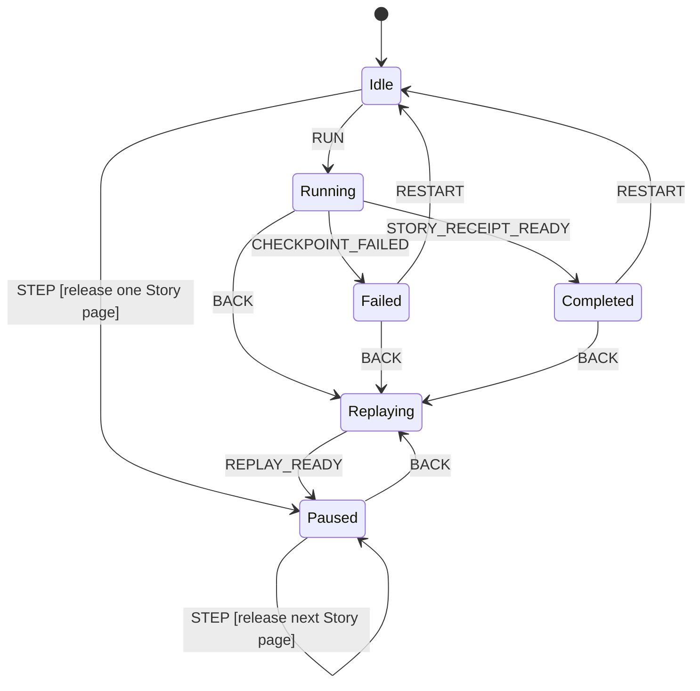

# Ignite Alchemy Narrative and Machine Matrix

Status: narrative gate before further visual iteration
Recorded: 2026-07-21
Task: `direct-1784661171192` / `task-1784655399770`

## Ownership and boundary table

| Concern | Primary authority/source of truth | Functional core | Imperative shell/adapter | Projection/UI |
| --- | --- | --- | --- | --- |
| Product narrative and operator controls | `ALCH-US-*` and `ALCH-NAR-*` in Ignite Alchemy | review policy, branch identity, control availability, receipt-first posture | product controller, replay orchestration, additive evidence joins | primary reviewer shell |
| Executable Story page order and receipt | `igniteTest({ component }).story(...)` | page semantics, checkpoint names, and final receipt truth stay in Story source | fixture setup, callback execution, teardown | preview and receipt content only |
| Voice Workbench session lifecycle | `voiceWorkbenchSessionMachine` | actor-owned lifecycle and derived views | actor startup, subscriptions, disposal | additive state facts only |
| Model turn, voice capture, and speech delivery | real child machines | authorization, timeout, cancellation, permission, and delivery facts | controlled ports and host adapters | additive evidence only |
| Optional XState lens | future additive observation join | exact / candidate / unavailable certainty policy | observation installation | Machine tab only |
| Coverage and gap review | future coverage join | uncovered / excluded classification | report assembly | additive review surfaces only |

## Lifecycle disposition gate

| Workflow/lifecycle | Disposition | Single authority | Evidence | Required action |
| --- | --- | --- | --- | --- |
| Product deterministic review flow | designed product contract | `ALCH-NAR-001-DETERMINISTIC-STORY-REVIEW` | scoped narrative docs in this task | retain as the design-driving operator journey |
| Product failure-first Debug branch | designed product contract | `ALCH-NAR-002-FAILED-CHECKPOINT-DEBUG` | scoped narrative docs in this task | retain and carry into visual work |
| Product Back replay branch | designed product contract | `ALCH-NAR-003-BACK-REPLAY` | scoped narrative docs in this task | retain; do not claim implementation |
| Product no-lens review branch | designed product contract | `ALCH-NAR-004-NO-LENS-REVIEW` | scoped narrative docs in this task | retain; fail closed when unavailable |
| Product additive advanced-evidence branch | designed product contract | `ALCH-NAR-005-ADVANCED-ADDITIVE-EVIDENCE` | scoped narrative docs in this task | retain as additive only |
| Executable Story page / checkpoint truth | implemented execution contract | existing Story executor | `workbench-narratives.test.ts` named stories | retain as bound subject truth |
| Voice Workbench parent session | explicit machine | `voiceWorkbenchSessionMachine` | `src/session.graph.test.ts`, `src/session.headless.test.ts`, README topology | retain and cite |
| Model turn child | explicit machine | `modelTurnMachine` | `src/model-turn.graph.test.ts` | retain and cite |
| Voice capture child | explicit machine | `voiceCaptureMachine` | `src/voice.graph.test.ts` | retain and cite |
| Speech delivery child | explicit machine | `speechDeliveryMachine` | `src/speech.graph.test.ts` | retain and cite |

## Product narratives to bound fixture evidence

| Product narrative | Operator-facing goal | Bound `STORY-*` evidence | Control implications | Terminal / rejoin |
| --- | --- | --- | --- | --- |
| `ALCH-NAR-001-DETERMINISTIC-STORY-REVIEW` | inspect a deterministic Story by selecting it, stepping once, then letting Run continue each remaining visible release before verifying the receipt | `STORY-002` | Story picker, Step, Run, receipt review, additive evidence tabs | terminal pass into receipt review |
| `ALCH-NAR-002-FAILED-CHECKPOINT-DEBUG` | diagnose a failed checkpoint without losing the selected fixture | selected fixture page where assertion failed, initially `STORY-002` | Debug auto-opens first; Back and Restart remain available | recoverable terminal |
| `ALCH-NAR-003-BACK-REPLAY` | move safely to a prior page | any selected `STORY-*` page replayed from scratch | Back triggers deterministic dispose / rebuild / replay | rejoins restored prior page |
| `ALCH-NAR-004-NO-LENS-REVIEW` | complete Story review without Machine proof | selected `STORY-001` or `STORY-002` | Machine tab shows `No XState lens`; ordinary review still completes | rejoins same Story review |
| `ALCH-NAR-005-ADVANCED-ADDITIVE-EVIDENCE` | inspect timeout or stale evidence without confusing it for active truth | `STORY-003` and `STORY-004` | additive Debug / Machine / Coverage context only | terminal review or rejoin to live-turn exit |

## Canonical subject-fixture seeds

| Story ID | Story name | Implemented subject truth | Named checkpoints | Commands | Final view truth | Why it matters to product design |
| --- | --- | --- | --- | --- | --- | --- |
| `STORY-001` | `preparation failure retries into ready` | retry from failed preparation into ready state | `ready after retry` | `beginModelPreparation` | `status: "ready"`, `model.status: "available"` | simplest pass and clean receipt |
| `STORY-002` | `microphone permission denial recovers to typed prompt` | permission denial remains visible while typed recovery starts a new turn | `voice permission stays a fact`, `text recovery starts a new turn` | `startVoiceCapture`, `submitPrompt` | `status: "responding"`, `voiceState: "permission"` | golden subject fixture for the golden product narrative |
| `STORY-003` | `timed out turn retries to an accepted response` | timeout returns idle, retry creates artifact, accepted completion returns ready | `timeout returns the turn to idle`, `retry can finish with an accepted artifact`, `accepted retry returns to ready` | `submitPrompt`, `createArtifact`, `completeResponse` | `status: "ready"`, accepted response text, artifact revision `1` | timeout and ordinary completion evidence |
| `STORY-004` | `stale correlated model receipts stay inert until the live turn ends` | stale first-turn result never mutates the live second turn | `cancelled first turn returns idle`, `second turn is responding`, `stale port result stays inert`, `live correlation still controls exit` | `submitPrompt` plus actor-owned cancel events | only the live turn controls return to ready | advanced stale-suppression evidence |

## Product-to-subject mapping rules

| Subject-fixture truth | Product obligation | Allowed product behavior | Forbidden product behavior | Maturity |
| --- | --- | --- | --- | --- |
| Given / Intent / Behavior / Checkpoint pages are named and ordered by the Story source | reveal the same page phases literally inside the selected review flow | step one page at a time or run all remaining pages | rename phases, merge away checkpoint identity, or invent mock application domains | designed |
| `canExecute` outcomes at each checkpoint come from the Story receipt | show control posture before / after each page | enable, disable, or defer controls according to the bound fixture truth | infer availability from layout convenience | designed |
| final receipt remains ordinary Story truth | keep receipt primary at completion or failure | show additive context, Machine, or Coverage tabs secondarily | replace the ordinary receipt with a topology-first explanation | designed |
| stale and unavailable evidence may exist | explain them honestly as additive evidence | candidate / unavailable language, optional Machine tab, no-lens fallback | manufacture exact causal confidence | designed |
| Back is not part of Story source | expose it as a product replay branch | dispose, rebuild, replay from fresh fixture | mutate snapshots in place or fake rewind | designed |

## Machine-validation receipts already supporting the design

| Machine / contract | Maturity | Evidence | Design implication |
| --- | --- | --- | --- |
| `voiceWorkbenchSessionMachine` | implemented | `src/session.graph.test.ts`, `src/session.headless.test.ts`, README topology | parent session lifecycle and supervision are authoritative subject truth |
| `modelTurnMachine` | implemented | `src/model-turn.graph.test.ts` | timeout, cancellation, stale-result correlation, and accepted completion already have machine truth |
| `voiceCaptureMachine` | implemented | `src/voice.graph.test.ts` | microphone permission denial is real fixture behavior, not a product invention |
| `speechDeliveryMachine` | implemented | `src/speech.graph.test.ts` | speech evidence remains additive and actor-owned |
| Story execution contract in `workbench-narratives.test.ts` | implemented | exact named stories, commands, pages, and checkpoints | product review surfaces must preserve page-by-page Story truth literally |

## Designed product controller contract

The product controller is still a designed Ignite Alchemy machine, not current
implemented truth. It exists to sequence review around the authoritative
subject-fixture executor.

| State/value | Accepted events | Public controls | Guard/policy | Effect/adapter | Emitted fact | Read model |
| --- | --- | --- | --- | --- | --- | --- |
| idle | select-story, run, step | Story picker, Run, Step | a selected `STORY-*` fixture is required | fresh fixture bootstrap | selected Story and initial page truth | selected Story summary |
| running | story-page-released, checkpoint-failed, story-receipt-ready, back | Run, Back | preserve bound Story page order and receipt truth | gated Story execution | current product page, current fixture checkpoint status | application preview + progress lane |
| paused | step, run, back | Step, Run, Back | one page per Step | host sequencing only | paused review boundary | page-by-page review |
| replaying | replay-ready | Back disabled until replay completes | dispose, rebuild, replay from fresh fixture | fixture teardown and reconstruction | restored prior page | replay status |
| completed | back, restart, open-receipt, open-machine, open-coverage | Back, Restart, Debug tabs | ordinary receipt stays primary | additive evidence joins only | final Story receipt | receipt-first completion surface |
| failed | back, restart, open-debug | Back, Restart, Debug tabs | failed checkpoint remains first Debug target | additive evidence joins only | failed checkpoint + ordinary receipt | failure-first review surface |

## Traceability from product narrative to subject truth

| Product narrative/page | Bound subject page source | Operator-visible product outcome | Preview / evidence summary | Controls before / after | Terminal / rejoin |
| --- | --- | --- | --- | --- | --- |
| `ALCH-NAR-001-PAGE-01-DISCOVER-GIVEN` | `STORY-002-GIVEN-READY` | Story selection and deterministic review setup are visible | exact starting view and `canExecute` posture | before: select Story; after: Step or Run | rejoin to first release |
| `ALCH-NAR-001-PAGE-02-STEP-INTENT-START-VOICE` | `STORY-002-INTENT-START-VOICE` | voice capture is shown as an explicit released intent | command trace shows `startVoiceCapture` | before: Step or Run; after: Step reveals behavior, Run continues sequential release | rejoin to permission behavior |
| `ALCH-NAR-001-PAGE-03-BEHAVIOR-PERMISSION-DENIED` | `STORY-002-BEHAVIOR-PERMISSION-DENIED` | permission denial becomes visible subject truth | denial evidence remains literal | before: permission pending; after: Step or Run reveals checkpoint | rejoin to permission checkpoint |
| `ALCH-NAR-001-PAGE-04-CHECKPOINT-PERMISSION-STAYS-A-FACT` | `STORY-002-CHECKPOINT-VOICE-PERMISSION-STAYS-A-FACT` | permission denial remains visible while typed prompt is still allowed | named checkpoint shown literally | before: waiting on permission fact; after: Step reveals typed fallback intent, Run continues sequential release | rejoin to typed fallback intent |
| `ALCH-NAR-001-PAGE-05-INTENT-TYPED-FALLBACK` | `STORY-002-INTENT-SUBMIT-TYPED-FALLBACK` | the typed fallback is shown as its own released intent | exact fallback text remains literal | before: typed fallback available; after: Step or Run reveals checkpoint | rejoin to responding checkpoint |
| `ALCH-NAR-001-PAGE-06-CHECKPOINT-NEW-RESPONDING-TURN` | `STORY-002-CHECKPOINT-TEXT-RECOVERY-STARTS-A-NEW-TURN` | the responding turn begins while the permission fact persists | named checkpoint shown literally | before: awaiting recovery; after: receipt review, Back, optional Machine tab | terminal pass |
| `ALCH-NAR-001-PAGE-07-VERIFY-RECEIPT` | Story terminal receipt | deterministic final receipt and command availability are reviewed after all visible releases | final preview and ordinary receipt remain primary | before: receipt closed; after: Back, Restart, additive evidence | terminal review state |
| `ALCH-NAR-002-FAILED-CHECKPOINT-DEBUG` | same Story page as the failed assertion | selected Story remains visible and Debug opens on the failed checkpoint first | ordinary receipt preserved, Debug prioritized | before: Step/Run; after: Debug, Back, Restart | recoverable terminal |
| `ALCH-NAR-003-BACK-REPLAY` | host replay to prior implemented Story page | prior page is restored by dispose / rebuild / replay | replay is explicit, not an in-place rewind | before: Back available; after: Step / Run resume | rejoins restored prior page |
| `ALCH-NAR-004-NO-LENS-REVIEW` | same Story page truth as implemented Story | Story review remains complete without graph proof | Machine tab says `No XState lens` | before: receipt review; after: continue Story review | rejoins same Story |
| `ALCH-NAR-005-ADVANCED-ADDITIVE-EVIDENCE` | `STORY-003` and `STORY-004` advanced receipts | timeout and stale evidence remain secondary | additive evidence stays secondary to the selected Story | before: advanced evidence hidden; after: review or exit | terminal review or live-turn rejoin |

## Guardrails for the next design round

- MagicPath may simulate Ignite Alchemy controls, but it must derive them from
  `ALCH-NAR-*` first and bind them to exact `STORY-*` fixture names second.
- It must not invent substitute application domains.
- It must keep ordinary receipt truth primary and XState evidence additive.
- It must treat no-lens and advanced additive evidence as first-class review
  branches, not hidden edge cases.
