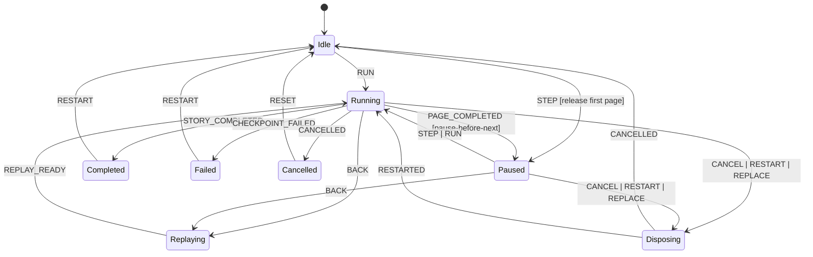

# Ignite Alchemy Narrative and Machine Matrix

Status: foundation gate
Recorded: 2026-07-21
Task: `direct-1784661171192` / `task-1784655399770`

## Ownership and boundary table

| Concern | Authority/source of truth | Functional core | Imperative shell/adapter | Projection/UI |
| --- | --- | --- | --- | --- |
| Story execution and final receipt | `igniteTest({ component }).story(...)` | page ordering and narrative semantics remain external inputs | fixture setup, Story callback execution, teardown | reviewer shell may display, never replace |
| Session lifecycle and workflow truth | `voiceWorkbenchSessionMachine` | reducers, policies, and derived views | actor startup, port subscriptions, runtime disposal | reviewer shell reads state-derived facts only |
| Model-turn lifecycle | `modelTurnMachine` | authorization/policy results and terminal facts | model adapter, timeout/cancel requests | surfaced as evidence only |
| Voice capture lifecycle | `voiceCaptureMachine` | passive receipt interpretation | browser voice adapter | surfaced as evidence only |
| Speech delivery lifecycle | `speechDeliveryMachine` | delivery facts and acknowledgment rules | speech adapter | surfaced as evidence only |
| Reviewer stepping session | future Story session controller | page identity joins, replay equivalence, control availability | gate release, cancellation, rebuild, replay | primary host-product surface |
| Optional topology and observation evidence | future XState lens | certainty classification and joins | actor observation installation | additive reaction/evidence views |
| Derived review report | future review report generator | bounded normalization and redaction | artifact writing | read-only CI/LLM consumption |

## Lifecycle disposition gate

| Workflow/lifecycle | Disposition | Single authority | Evidence | Required action |
| --- | --- | --- | --- | --- |
| Executable Story receipt lifecycle | explicit machine-like execution contract | existing Story executor | narrative ergonomics audit + executable stories | retain as authority |
| Reviewer Story session controller | implicit-needs-machine | future Ignite Alchemy controller | queued controller task `task-1784602868853` | formalize and implement |
| Voice Workbench parent session | explicit machine | `voiceWorkbenchSessionMachine` | `src/session.graph.test.ts`, `src/session.headless.test.ts`, README topology | retain and cite |
| Model-turn child | explicit machine | `modelTurnMachine` | `src/model-turn.graph.test.ts` | retain and cite |
| Voice capture child | explicit machine | `voiceCaptureMachine` | `src/voice.graph.test.ts` | retain and cite |
| Speech delivery child | explicit machine | `speechDeliveryMachine` | `src/speech.graph.test.ts` | retain and cite |
| Coverage join and gap review | reducer-owned / policy-or-effect-facts | future coverage projection | W1 architecture + future coverage task | design, do not imply implementation |
| Topology and observation certainty | policy-or-effect-facts | future XState lens + joins | W1 architecture + future lens task | design, do not overclaim |
| Prototype-only panel state | presentation-only | MagicPath local component state | MagicPath component interactions | keep explicitly non-authoritative |

## Current implemented machine receipts

| Machine | Maturity | Source and diagram | Reachable states | Event dispositions | Required paths | Forbidden invariants | Snapshot and serialization | Ownership and supervision | Evidence | Verdict |
| --- | --- | --- | --- | --- | --- | --- | --- | --- | --- | --- |
| Parent session | implemented | README parent-supervised topology + `src/session.graph.test.ts` | preparing, unavailable, available.turn idle/responding, available.voice active, available.speech idle/delivering | explicit graph checks plus stale receipt fencing | ready, retry, timeout, stale receipt, Story composition | no duplicate lifecycle writer; stale receipts inert | semantic serializer and headless receipts | parent owns aggregate conversation projection and child supervision | `src/session.graph.test.ts`, `src/session.headless.test.ts` | pass |
| Model-turn | implemented | README child topology + `src/model-turn.graph.test.ts` | requesting, authorizing, executing, completed, failed, cancelled, timedOut, exhausted | graph assertions over correlated terminal outputs | bounded requesting/authorizing/executing reachability, stale receipt inertness | terminal output remains correlated and serializable | terminal output serialized | invoked child with fixed owner boundary | `src/model-turn.graph.test.ts` | pass |
| Voice capture | implemented | README lifecycle contract + `src/voice.graph.test.ts` | idle, listening/active, unsupported, unavailable, terminal outcomes | interactive graph + stale adapter receipts | supported interactive flow, exclusions, stale inertness | stale adapter receipts cannot satisfy newer attempt | projection remains serializable | persistent invoked child | `src/voice.graph.test.ts` | pass |
| Speech delivery | implemented | README lifecycle contract + `src/speech.graph.test.ts` | queued, delivering, delivered, unavailable, failed, cancelled | reachable queued and terminal facts | correlated output and unavailable path | stale receipts inert, actor owns acknowledgment | output facts serializable | replaceable invoked child | `src/speech.graph.test.ts` | pass |

## Designed reviewer session controller

The reviewer session controller is not implemented yet. This task records its
complete transition contract so later work has a single target.

| Machine | State/value | Accepted events | Public commands | Guard/policy | Effect/adapter | Emitted fact | Error/recovery | Screen/read model |
| --- | --- | --- | --- | --- | --- | --- | --- | --- |
| Story session controller | idle, running, paused, replaying, disposing, completed, failed, cancelled | run, step, back, restart, cancel, page-completed, story-completed, checkpoint-failed, replay-ready | Run, Step, Back, Restart, Cancel | one-page release, generation-scoped stale suppression, dispose-before-rebuild | Story callback gate, fixture disposal, replay bootstrap, optional observation join | transient page outcome, current certainty, final ordinary receipt | restart from fresh fixture, cancel, stale suppression | Story catalog, phase lane, receipt/evidence panels, coverage review |

| Machine | Raw state value | Context | Native metadata | Derived view | Command availability | Snapshot consumers |
| --- | --- | --- | --- | --- | --- | --- |
| Story session controller | literal session state | selected `storyId`, page cursor, completed pages, generation, optional lens status, final ordinary receipt | none required beyond internal session bookkeeping | prepared session header, page lane, control bar, receipt/evidence panels, gap review | derived from session state and page boundary | future Vite host, POC, implementation handoff |

Required queued implementation evidence:

- controller task `task-1784602868853`
- POC task `task-1784655415553`
- handoff task from `.fas/tasks/produce-the-approved-ignite-alchemy-mvp-implementation-hando.md`

## Narrative-to-machine traceability

| Narrative/branch | Step | User action/observation | Public command/input | Authority | From/to state or decision | Expected fact | Derived projection | Surface | Evidence |
| --- | --- | --- | --- | --- | --- | --- | --- | --- | --- |
| `NAR-001-PRIMARY` | 1 | chooses Story from catalog | select Story | reviewer session controller (future) | idle -> idle with selected `storyId` | selected Story changes | catalog highlight + Story summary | landing header / picker | W1 architecture + this task |
| `NAR-001-NO-LENS` | 2 | sees no observation overlay | none; read-only posture | optional lens contract | no lens attached | certainty unavailable | `no XState lens` badge | evidence mode panel | W1 architecture |
| `NAR-002-PRIMARY` | 1 | presses Step/Run | step / run | reviewer session controller over existing Story executor | idle -> paused/running | one page released | current phase and page card | main narrative pane | controller task + Story ergonomics audit |
| `NAR-002-ASSERTION-FAILURE` | 2 | sees failed Checkpoint | none after checkpoint completion | existing Story receipt + controller failure posture | running -> failed | failed Checkpoint fact | failure panel + retry posture | failure view | existing Checkpoint receipts |
| `NAR-002-CANDIDATE-EVIDENCE` | 3 | sees candidate edge/state cue | none; derived observation | future XState lens + coverage join | exact proof unavailable | candidate certainty | candidate badge + explanation | evidence panel | W1 architecture + future lens task |
| `NAR-003-PRIMARY` | 4 | presses Back | back | reviewer session controller | paused/running -> replaying -> paused | fresh-fixture replay fact | replay status + target prior page | control rail + phase lane | W1 replay rules + controller task |
| `NAR-003-CANCELLED` | 5 | presses Cancel | cancel | reviewer session controller | running/paused -> disposing -> cancelled/idle | cancellation fact | cancelled status and reset controls | control rail | existing cancellation narrative + controller task |
| `NAR-003-STALE-SUPPRESSED` | 6 | obsolete result arrives after replacement | none; stale external result | controller generation rule | no state change to active generation | stale ignored | no unexpected UI mutation | evidence/log panel | stale receipt narrative |
| `NAR-004-PRIMARY` | 7 | opens final receipt and evidence panes | projection-only tabs | final Story receipt remains authority | completed session | ordinary final receipt | receipt pane + additive evidence panes | lower evidence surfaces | W1 report boundary |
| `NAR-004-GAP-REVIEW` | 8 | reviews uncovered gap list | projection-only filters | future coverage join | uncovered or excluded coverage classification | gap provenance | uncovered-gap review | coverage pane | W1 coverage contract |
| `NAR-005-1024-RESILIENT` | 9 | compresses width to 1024 | viewport change | prototype layout only | no behavior change | same facts as current session | stacked or collapsed evidence panes | responsive layout | required measurements |

## Race and precedence matrix

| Competing stimuli | Authoritative owner | Admission and ordering rule | Losing or stale outcome | Emitted fact/projection | Invariant and evidence |
| --- | --- | --- | --- | --- | --- |
| Step vs Run | reviewer session controller | exactly one page release per Step; Run drains remaining pages | duplicate release rejected | paused/running state reflects single active release | one page per Step; future controller tests |
| Back vs late page completion | reviewer session controller generation | Back increments generation and disposes before replay | late completion ignored as stale | replaying state remains authoritative | no obsolete session update; stale suppression task |
| Cancel vs pending behavior/adapter result | reviewer session controller + fixture teardown | cancel settles gates and disposes exactly once | late result ignored | cancelled/disposed state | no duplicate writer; controller task |
| completed receipt vs observation update | final Story receipt + future lens join | ordinary final receipt stays primary; observation remains additive | observation cannot replace receipt | completed receipt view plus evidence pane | receipt-first rule; W1 architecture |
| exact vs candidate vs unavailable evidence | future lens join policy | exact only when directly proven; else candidate or unavailable | false exactness rejected | explicit certainty label | W1 certainty boundary |

## Prototype direction guardrails

- `DIR-A` and `DIR-B` may experiment with hierarchy, density, motion, and
  layout.
- Neither direction may invent new reviewer commands, runtime states, or
  machine truth beyond this matrix.
- Both directions must keep non-color cues for certainty, failure, and gap
  states.
