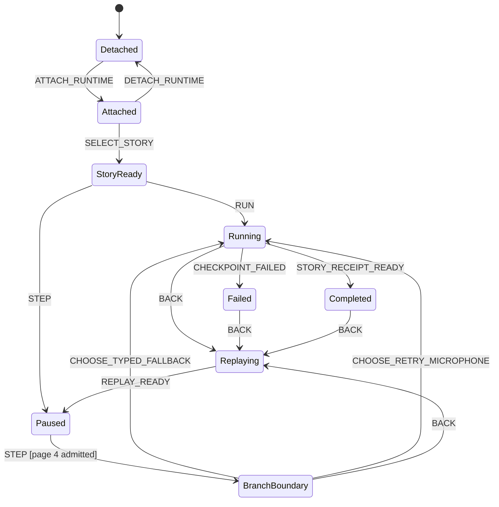

# Ignite Alchemy Narrative and Machine Matrix

Status: narrative-ready for the dev/test companion-tool direction
Recorded: 2026-07-22
Task: `direct-1784661171192` / `task-1784655399770`

## Ownership and boundary table

| Concern | Primary authority/source of truth | Functional core | Imperative shell/adapter | Projection/UI |
| --- | --- | --- | --- | --- |
| Product devtool shell and operator controls | `ALCH-US-*` and `ALCH-NAR-*` | tool policy, branch identity, attach/detach posture, receipt-first inspection | Alchemy controller, dev-only bridge lifecycle, replay orchestration | Alchemy shell and docked Inspector |
| Executable Story page order and receipt | `igniteTest({ component }).story(...)` | page semantics, checkpoint names, branch availability, final receipt truth | fixture setup, callback execution, teardown | preview and receipt content only |
| Voice Workbench session lifecycle | `voiceWorkbenchSessionMachine` | actor-owned lifecycle and derived views | runtime startup, subscriptions, disposal, HMR/reconnect | subject facts only |
| Model turn, voice capture, and speech delivery | real child machines | timeout, cancellation, permission, delivery, and retry facts | host adapters and ports | additive inspection only |
| Headless/CI parity | `igniteTest().story()` semantics | same Story/controller receipts without Alchemy rendering | test runtime bootstrap | receipt output only |
| Production absence invariant | build/security contract | optimized subject application build ships no Alchemy surface or bridge by default | build exclusion and environment gating | no production projection |

## Lifecycle disposition gate

| Workflow/lifecycle | Disposition | Single authority | Evidence | Required action |
| --- | --- | --- | --- | --- |
| Alchemy dev/test launch and attach | designed product contract | `ALCH-NAR-002-ATTACH-AND-DETACH` | scoped narrative docs in this task | retain as the first tool-host state |
| Golden tool-hosted Story walkthrough | designed over implemented fixture | `ALCH-NAR-001-DEVTOOL-STORY-REVIEW` over `STORY-002` | scoped narrative docs plus existing Story source | retain as the design-driving operator journey |
| Page-4 typed fallback branch | designed over implemented command | `ALCH-NAR-001-BRANCH-TYPED-FALLBACK` | `workbench-narratives.test.ts:600-621` | retain as the declared Run default |
| Page-4 retry microphone branch | designed over implemented command | `ALCH-NAR-001-BRANCH-RETRY-MICROPHONE` | `workbench-narratives.test.ts:600-613`, `main.test.tsx:613-632` | retain as the alternate branch choice |
| Back replay branch | designed product contract | `ALCH-NAR-004-BACK-REPLAY` | scoped docs in this task | retain and keep deterministic |
| Failed-checkpoint Debug | designed product contract | `ALCH-NAR-003-FAILED-CHECKPOINT-DEBUG` | scoped docs in this task | retain and keep failure-first |
| No-lens review | designed product contract | `ALCH-NAR-005-NO-LENS-REVIEW` | scoped docs in this task | retain and fail closed |
| Headless/CI parity | designed product contract | `ALCH-NAR-006-HEADLESS-CI-PARITY` | scoped docs in this task | retain; do not claim shipped harness yet |
| Production absence | designed build/security contract | `ALCH-NAR-007-PRODUCTION-ABSENCE` | scoped docs in this task | retain as explicit exclusion proof |
| Executable Story page/checkpoint truth | implemented execution contract | existing Story executor | `workbench-narratives.test.ts` named stories | retain as bound subject truth |
| Voice capture retry after denial | implemented subject behavior | current Voice Workbench runtime | `main.test.tsx:613-632` | retain as real alternate branch evidence |

## Operator narratives to bound subject evidence

| Product narrative | Operator-facing goal | Bound subject truth | Control implications | Terminal / rejoin |
| --- | --- | --- | --- | --- |
| `ALCH-NAR-001-DEVTOOL-STORY-REVIEW` | launch Alchemy, attach Voice Workbench, review a deterministic Story, branch when required, inspect, and detach | `STORY-002` | attach status, Story controls, branch lane, Inspector tabs, detach control | terminal tool review |
| `ALCH-NAR-001-BRANCH-TYPED-FALLBACK` | continue the golden branch through typed recovery | page-4 `submitPrompt: true` and current pages 5-7 | branch lane chooses typed fallback or Run defaults to it | rejoins page 5 |
| `ALCH-NAR-001-BRANCH-RETRY-MICROPHONE` | continue the alternate recovery branch through microphone retry | page-4 `startVoiceCapture: true` and retry behavior after denial | branch lane chooses retry microphone and Machine edge highlights the transition from permission-denied recovery posture into the child listening attempt | rejoins next voice attempt |
| `ALCH-NAR-002-ATTACH-AND-DETACH` | attach, disconnect, restart, or reattach the subject runtime | bridge/host lifecycle only | attach/detach status, unsupported state, reconnect state | recoverable; rejoins selection |
| `ALCH-NAR-003-FAILED-CHECKPOINT-DEBUG` | diagnose a failed checkpoint without losing the selected fixture | same selected Story page where the assertion failed | Inspector auto-opens on Debug | recoverable terminal |
| `ALCH-NAR-004-BACK-REPLAY` | move safely to a prior page or branch boundary | selected Story page replayed from scratch | Back rebuilds deterministic state and truncates future evidence | rejoins restored page |
| `ALCH-NAR-005-NO-LENS-REVIEW` | complete review without Machine proof | same Story page truth as the selected Story | Machine tab shows `No XState lens` | rejoins same review |
| `ALCH-NAR-006-HEADLESS-CI-PARITY` | run the same Story semantics without rendering Alchemy | same Story pages/receipt and branch default | no Alchemy shell required in CI | terminal receipt |
| `ALCH-NAR-007-PRODUCTION-ABSENCE` | prove no Alchemy surface ships by default | build/security evidence only | no production-mode UI allowed | terminal pass/fail |

## Subject-to-tool mapping rules

| Subject truth | Tool obligation | Allowed tool behavior | Forbidden tool behavior | Maturity |
| --- | --- | --- | --- | --- |
| Given / Intent / Behavior / Checkpoint pages are named and ordered by the Story source | reveal the same page phases literally inside the selected tool flow | step one page at a time or run all remaining pages | rename phases, merge checkpoint identity, or invent app-domain pages | designed |
| page-4 `canExecute` admits `startVoiceCapture` and `submitPrompt` | pause at a branch boundary and expose only those two choices in the tool lane | default to typed fallback on Run, allow explicit retry microphone choice, record branch choice in replay/receipt | invent Cancel or bypass subject guards | designed over implemented commands |
| final receipt remains ordinary Story truth | keep receipt primary only when the branch reaches terminal receipt | show additive Debug/Machine/Evidence secondarily | expose future receipt facts before page 7 | designed |
| Back is not part of Story source | expose it as deterministic replay | rebuild to prior page or branch boundary from a fresh fixture | mutate snapshots in place or fake rewind | designed |
| Alchemy is dev/test-only | keep host, bridge, and inspection surfaces out of optimized subject application builds | local host, dogfood example, CI parity harness | public production route or default shipped bridge | designed |

## Designed tool controller contract

| State/value | Accepted events | Public controls | Guard/policy | Effect/adapter | Read model |
| --- | --- | --- | --- | --- | --- |
| detached | attach-runtime | Attach | dev/test host only | bridge/bootstrap | detached shell |
| attached | select-story, detach-runtime | Story select, Detach | subject runtime reachable | bridge subscription | connected shell |
| story-ready | run, step, open-inspector | Run, Step, Inspector | selected Story required | Story bootstrap | ready preview |
| paused | step, run, back, open-inspector | Step, Run, Back, Inspector | one page per Step | gated Story execution | current page |
| branch-boundary | choose-typed-fallback, choose-retry-microphone, back, open-inspector | branch lane, Back, Inspector | choices limited to admitted subject commands | branch provenance record, command dispatch | branch chooser + page-4 subject truth |
| running | page-released, checkpoint-failed, story-receipt-ready, back | Run, Back | Run defaults to typed fallback unless reviewer interaction is required | Story execution | progressing preview |
| completed | back, restart, open-inspector, detach-runtime | Back, Restart, Inspector, Detach | receipt remains ordinary truth | additive joins only | final review |
| failed | back, restart, open-inspector | Back, Restart, Inspector | Debug first | additive joins only | failure-first review |

## Traceability from operator narrative to subject truth

| Product narrative/page | Bound subject source | Operator-visible outcome | Preview / evidence summary | Controls before / after | Terminal / rejoin |
| --- | --- | --- | --- | --- | --- |
| `ALCH-NAR-001-PAGE-00-LAUNCH-AND-ATTACH` | host attach state | `Ignite Alchemy` shell opens with env badge and subject connection status | host-only facts | before: launch; after: Story select | rejoin selection |
| `ALCH-NAR-001-PAGE-04-CHECKPOINT-PERMISSION-STAYS-A-FACT` | `STORY-002` checkpoint at lines `600-613` | branch boundary is explicit in the tool lane | `startVoiceCapture: true`, `submitPrompt: true`, denial remains fact | before: Step/Run; after: choose branch or default Run | branch boundary |
| `ALCH-NAR-001-BRANCH-TYPED-FALLBACK` | `STORY-002` intent/checkpoint at lines `615-632` | typed fallback continues the current golden pages 5-7 | exact fallback input and responding checkpoint | before: branch choice; after: receipt review | rejoins page 5 |
| `ALCH-NAR-001-BRANCH-RETRY-PAGE-01-INTENT-START-VOICE-RETRY` | page-4 `canExecute` plus `main.test.tsx:613-632` | retry microphone is explicitly chosen and dispatches public `startVoiceCapture` | branch choice and retry command are recorded in replay/receipt provenance | before: branch choice; after: retry checkpoint | rejoins branch page 2 |
| `ALCH-NAR-001-BRANCH-RETRY-PAGE-02-CHECKPOINT-VOICE-ATTEMPT-LISTENING` | `main.test.tsx:613-632` | child voice capture re-enters listening with a new attempt | Machine highlights the edge from permission-denied recovery posture into the child listening attempt; Inspector may show additive attempt/sequence evidence | before: retry dispatch; after: inspect or Back | alternate recoverable rejoin |
| `ALCH-NAR-005-NO-LENS-REVIEW` | same selected Story page truth | Machine tab says exactly `No XState lens` | Story and receipt remain intact | before: receipt review; after: continue | rejoins same Story |
| `ALCH-NAR-006-HEADLESS-CI-PARITY` | same Story/controller semantics | CI receipt aligns with tool-hosted semantics without rendering | branch default and receipt remain the same | before: CI run; after: receipt | terminal receipt |
| `ALCH-NAR-007-PRODUCTION-ABSENCE` | build/security evidence | optimized subject application build exposes no Alchemy surface | absence proof only | before: build; after: pass/fail | terminal contract |

## Deferred downstream implementation ownership

- `task-1784602868853`: Story controller branch lane, branch defaulting, replay,
  and headless parity execution.
- `task-1784602883094`: Machine/XState topology, active-state view, retry-edge
  highlight, and exact fallback copy.
- `task-1784602901002`: dev/test host shell, attach/detach lifecycle, docked
  split-pane Inspector, and subject-build production exclusion.
- `task-1784602939863`: replay/receipt provenance, branch-choice durability,
  and deterministic rejoin evidence.
- `task-1784602955608`: later package/distribution decision only.
