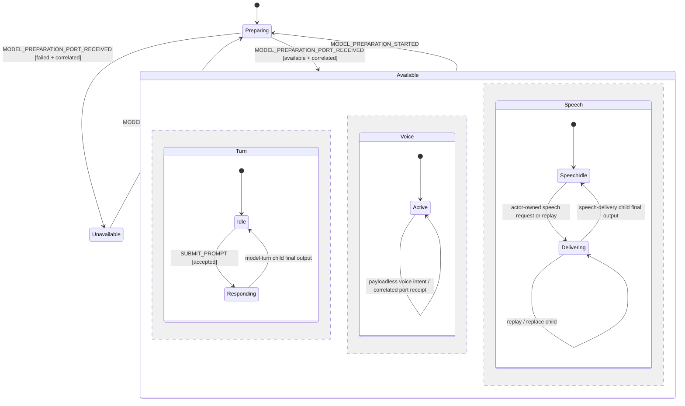
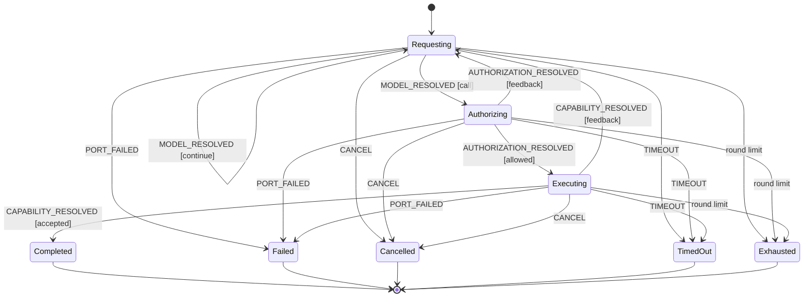

# Voice and text workbench

This example starts with an empty conversation and proves one Ignite component
can accept typed or spoken prompts, authorize model-proposed semantic changes,
and project the accepted result to browser, terminal, and speech consumers.

It is a POC/MVP for agent-authored interfaces, not a scripted product tour. The
artifact workspace is actor-owned state. It changes only after the configured
model or a projected control invokes an authorized artifact command and the
actor validates the semantic change.

## What the example proves

The public Ignite component exposes 19 commands across user intent, model
intent, and presentation controls. The actor-owned behavior contract centers on
eight domain commands:

- `submitPrompt`
- `createArtifact`
- `reviseArtifact`
- `restoreArtifactRevision`
- `selectArtifact`
- `setChecklistItem`
- `completeResponse`
- `acknowledgeSpeech`

Text and speech are two input adapters for the same `submitPrompt` command.
Additional public commands keep browser intent actor-owned without exposing the
source: draft, panel, artifact-view, runtime-preview, speech-preference,
replay, voice-capture, and preparation controls all stay outside the model's
tool surface. The model receives a narrower allowlist from `getSchema()` through
a fresh `igniteTools(component)` manifest on every model round:
`createArtifact`, `reviseArtifact`, `setChecklistItem`, and
`completeResponse`. It may propose semantic artifacts and responses, but it
cannot write DOM, JSX, JavaScript, or actor state directly.

The bounded pure turn protocol executes one proposed tool call, returns its
correlated Ignite observation to the model, and derives the next manifest from
the updated actor state. An artifact mutation and `completeResponse` therefore
cannot be accepted in the same unobserved round. Invalid or stale input returns
structured actor feedback that the model can repair on its next round.

The browser can optionally federate that component manifest with reusable
external capability providers. The example includes one provider-neutral
`searchWeb` contract backed by a same-origin server route and Brave Web Search.
Every manifest entry has exactly one owner. Duplicate tool names reject the
combined manifest before model inference, and each call routes only to its
recorded owner. External success, unavailable, validation, timeout, and provider
failure outcomes return as bounded facts with receipts; they never mutate the
conversation actor directly.

One `searchWeb` call accepts 1–8 focused `{ subject, query }` requests, an
optional two-letter country code, and 1–5 results per request. The model still
makes one tool call and receives one aggregated result; the server schedules the
individual Brave requests internally. Each returned search preserves its
subject identity. A price becomes `sourced` only when one unambiguous
currency-marked decimal is present in a returned source; otherwise the subject
remains `unverified` with no invented numeric value. This keeps a multi-item
research turn inside the five-round model budget, and its receipt records both
query and source counts.

Before `completeResponse` can close a researched turn, a pure evidence audit
compares those accepted search facts with the current actor view. Checklist
labels remain action state, while a semantic table must preserve each subject's
exact Price, Status, and Source. Evidence charts may contain exact sourced
numeric values but must exclude unverified values. Incomplete evidence returns
bounded structured feedback to the next model round so it can revise the
artifact instead of completing with an unsupported projection.

The same-origin route rejects request bodies larger than 16 KiB before buffering
additional chunks. Search titles, URLs, descriptions, per-query results, and the
total source set are bounded before evidence enters model context. The latest
sanitized provider receipt or manifest collision is retained in presentation
state and shown in the live runtime inspector; raw responses and server
credentials are never retained there.

Rate limiting stays inside the server adapter. A shared server-side gate paces
Brave requests within and across batches from the provider's short-window
remaining/reset headers, so a multi-subject call does not burst over a
one-request-per-second plan. Brave `429` and `503` responses receive at most one
retry after the initial request by default. Numeric and HTTP-date `Retry-After`
guidance is honored within a bounded delay; when it is absent, Brave's
`X-RateLimit-Reset` guidance supplies the retry delay. The final failure returns
attempt counts, provider status, and exhaustion as structured facts instead of
throwing. Concurrent identical normalized requests share one in-flight
execution, while only successful exact requests enter the bounded 15-second
cache. Cache hits, misses, coalesced calls, and TTL remain visible in the
sanitized receipt. An alternate provider runs only when explicitly injected and
configured for the exhausted status; the adapter never invents fallback
evidence.

This keeps the workbench shell generic. Shopping research is the first optional
domain pack, not a shopping-specific Ignite component or renderer. The pack
constrains product selection and evidence quality. The generic path remains
model-owned: the model uses the existing `createArtifact` or `reviseArtifact`
commands to compose any supported list, table, chart, timeline, decision log,
or mixed-node document. An applicable domain pack may optionally materialize a
canonical artifact from accepted domain facts before the actor executes that
command. Packs without that hook, hooks that return `null`, and unrelated
prompts preserve the model proposal unchanged. HTTP and HTTPS values in table
cells become safe source links, while chart nodes retain a textual accessible
name and per-series values.

For the supported Whole Foods Sarasota scope, the model never authors a search
query or product identity. It first calls `prepareProductPricing` with retailer,
location, and ordered subject-only items. If the first decision is rejected or
needs input, the model may repair that policy request once; the latest decision
supersedes the first. An admitted decision exposes `priceProducts` for one call
with the exact retailer, location, and ordered subjects. The provider owns
product and package-size selection.

For every subject, the provider first calls Whole Foods' store-scoped native
search and accepts only the bounded
`mainResultSet.searchResults[].asin` envelope. It fetches offer details for the
deduplicated candidate ASINs in one batch, then applies the versioned
`whole-foods-candidate-v1` ranking policy. Low-confidence or closely ranked
candidates remain explicitly `unverified`; there are no catalog aliases or
model-supplied product defaults. The offer response must match the selected
ASIN, parse a product and package size, report `GROCERY` and `IN_STOCK`, and
contain a positive USD price. Unrelated numeric values never become evidence.

Selected identities—not prices—enter an injected 300-second, 64-entry LRU keyed
by store, normalized subject/query, and ranking-policy version. Concurrent
identical discovery calls coalesce, while every request still performs a fresh
offer batch. Brave runs with zero retries only after a decoded HTTP 200 native
search returns no candidates. Native transport errors, schema drift, and
ambiguous rankings never spend Brave. The aggregate fact preserves every
subject, provider selection, sourced or unverified price, and native/cache/Brave
receipt; `queryCount` counts only discovery requests actually made.

## Lifecycle machine contract and maturity

The workbench exports `voiceWorkbenchSessionMachine` as reusable,
unstarted XState logic and `createVoiceWorkbenchSessionActor()` as the fresh
actor boundary. It does not export a shared actor, component, schema, or
mutation helper. Browser, terminal, parity, and headless composition roots each
create and own their actor, Ignite component, ports, and runtime disposal.

The checked characterization receipts now live beside the source:

- `src/session.graph.test.ts` validates the parent topology, deterministic
  reachable session vertices, stale preparation correlation, the fixed invoked
  child IDs, and the direct XState-graph-to-Story composition proof.
- `src/model-turn.graph.test.ts` validates the child turn topology, bounded
  requesting/authorizing/executing reachability, correlated terminal output, and
  stale receipt rejection.
- `src/voice.graph.test.ts` validates the supported interactive graph, explicit
  unsupported and unavailable exclusions, and stale adapter receipt handling.
- `src/speech.graph.test.ts` validates the delivery topology, reachable queued
  and terminal states, and correlated output facts.
- `src/architecture.test.ts` validates that every production example module is
  owned by `architecture-boundaries.json` and that the reviewed import-violation
  baseline cannot grow silently.
- `narrative-ergonomics-audit.md` records the post-dogfood verdict that the
  current `igniteTest({ component }).story(...)`, `record()`, and
  `snapshotStory()` surfaces are sufficient for the seven executable stories
  without adding a
  new public receipt envelope or bridge API.
- `xstate-graph-story-evaluation.md` records the follow-on graph verdict:
  direct XState composition is enough, `getPathsFromEvents(...)` should select
  the public-intent prefix, Story plus fixture behavior should prove correlated
  timeout outcomes, and no Ignite-side graph bridge API is justified.

### Direct XState graph composition

The supported pattern is deliberately split across two layers:

1. Use `xstate/graph` to characterize reachability over raw machine state.
   For Voice Workbench, `getShortestPaths(...)` and `getSimplePaths(...)` prove
   deterministic session vertices, while `getPathsFromEvents(...)` can use
   `MODEL_PREPARATION_PORT_RECEIVED` as local setup data to reach `ready` and
   then start the public user-intent prefix with `SUBMIT_PROMPT`.
2. Use `igniteTest({ component }).story(...)` to prove the user-visible
   behavior that depends on runtime correlation, fixture-owned ports, and
   semantic evidence. The example-local fixture drives the real
   `ready -> submit prompt -> timeout -> ready` outcome and checkpoints the
   semantic snapshot, projected view, and command availability.

That split is the user value:

- generated reachability paths plus user-visible behavioral proof;
- normal Story receipts, trace, and diagnostics;
- explicit drivers that keep private machine facts private, with setup receipts
  staying local to characterization and `SUBMIT_PROMPT` mapping to
  `narrative.intent(...)`; and
- fresh fixtures that isolate each replay without adding a new Ignite testing
  DSL or dependency.

`createTestModel(...)` remains comparison-only here. On XState `5.32.1`, it
rejects invoked machines with `Invocations on test machines are not supported`,
so it is useful as a characterization boundary, not as the Voice Workbench
narrative runner.

The parent session is a host-agnostic compound statechart. Its `available`
state is parallel: turn orchestration, persistent voice capture, and speech
delivery advance independently without creating impossible combinations.
Invoked children have fixed IDs—`model-turn`, `voice-capture`, and
`speech-delivery`—and return terminal facts through XState output. The parent
is the only consumer of those outputs and the only owner of the aggregate
conversation projection.

### One owner per lifecycle or fact

The exported `voiceWorkbenchLifecycleOwnership` data mirrors this table so
tests and graph tooling can detect ownership drift:

| Surface | Single owner | Representation |
| --- | --- | --- |
| Session readiness and turn supervision | `voiceWorkbenchSessionMachine` | Parent statechart |
| Model-turn orchestration | `modelTurnMachine` | Invoked child statechart |
| Voice capture | `voiceCaptureMachine` | Persistent invoked child statechart |
| Speech delivery | `speechDeliveryMachine` | Replaceable invoked child statechart |
| Conversation and artifacts | `reduceConversationSession` | Pure reducer consumed by the parent |
| Domain admission and authorization | Domain-pack policies | Deterministic typed facts |
| Capability and LLM execution | Port adapters | Correlated typed receipts |
| UI presentation state | `reduceWorkbenchPresentation` | Pure reducer |
| UI-readable values | `projectVoiceWorkbenchView` | Pure snapshot projection |
| Browser, terminal, and headless effects | Host composition roots | Imperative shell |

Reducers and typed result unions remain authoritative for data and decisions.
Statecharts own lifecycles. Ignite projects snapshots and binds commands; it is
not another writer of provider, turn, voice, speech, policy, capability,
conversation, or artifact truth. The LLM stays at the outer adapter boundary:
it may propose a command, but deterministic policy, authorization, statechart
guards, and reducer validation decide whether that proposal is admitted.

### Parent-supervised topology



The exact raw parent shape is:

```text
"preparing"
"unavailable"
{
  available: {
    turn: "idle" | "responding",
    voice: "active",
    speech: "idle" | "delivering"
  }
}
```

An accepted prompt enters `available.turn.responding` and invokes exactly one
`model-turn` child. That child owns its attempt identity and all requesting,
authorizing, executing, cancellation, timeout, failure, and round-limit states.
Its final output contains one terminal fact plus the bounded result. The parent
commits a staged response only for a correlated `TURN_COMPLETED` output; every
other terminal discards the staged completion before returning the turn region
to idle.

### Architecture boundary baseline

`architecture-boundaries.json` is intentionally a characterization artifact, not
the new runtime authority. It records the current module ownership and the
reviewed violations that still need reduction in downstream extraction tasks.

As of July 18, 2026, the reviewed baseline is four import-direction violations,
all caused by `src/domains/product-pricing/price-capability.ts` still acting as
an adapter dependency across deterministic and projection consumers:

- `src/domains/product-pricing/authorization.ts`
- `src/domains/product-pricing/index.ts`
- `src/session.ts`
- `src/workbench-view.ts`

The architecture test fails if any additional file or rule is added to that
baseline without review.



The voice child is invoked for the lifetime of `available`. It owns the
durable capture sequence, attempt ID, port sequence, transcript, and retry
lifecycle. `startVoiceCapture`, `cancelVoiceCapture`, and
`submitVoiceTranscript` send payloadless intent because the caller contributes
no new fact. The child allocates internal correlation. Browser recognition
returns only correlated `RESULT`, `END`, `PERMISSION_DENIED`, or `FAIL`
receipts. A final transcript becomes a speech prompt only after the child
accepts `CONSUME`; stale receipts cannot satisfy a newer attempt.

The speech region invokes a replaceable child only while delivery is active.
The parent allocates each automatic or replay request from authoritative
context. The child owns queued, delivered, muted, unavailable, failed, and
cancelled outcomes. Replaying reenters `delivering`, stops the old child, and
starts a new correlated attempt. Aggregate speech acknowledgement remains
separate from delivery truth.

### Typed ports and host runtime

Machines contain only serializable state, inputs, events, and outputs. They do
not contain `AbortController`, timers, browser recognition objects, speech
utterances, fetch clients, component handles, or disposal callbacks.
`ports.ts` defines the host boundary:

- model preparation receives `prepare-model` and returns an available or
  failed receipt with the same sequence;
- model turn receives the current child request and returns one correlated
  receipt plus optional bounded read-model facts;
- voice capture and speech delivery receive projected requests and emit
  correlated streaming receipts;
- the clock port returns a disposable timeout handle.

`createVoiceWorkbenchRuntime()` is the imperative shell. It subscribes to one
parent actor, deduplicates projected requests, owns abort controllers and the
whole-turn clock, disposes replaced voice/speech effects, and sends receipts
back with the exact request that produced them. A late promise may settle, but
the parent rejects it when its turn, attempt, or sequence no longer matches.
Non-persisted `pagehide` disposes the runtime and stops the actor; persisted
history navigation leaves the composition root alive.

Environment-specific adapters live under `src/adapters/`:

```text
adapters/
├─ mlx-model-turn.ts   MLX, Ignite tools, domain registry, and capabilities
├─ browser-voice.ts    SpeechRecognition port
└─ browser-speech.ts   speechSynthesis port
```

These adapters implement ports; they do not become lifecycle authorities.
`main.tsx` composes browser adapters, `terminal.ts` composes terminal-safe
ports, and the headless/parity roots use deterministic ports. Adding a new host
changes the composition root and adapters, not the machines.

### Commands, events, and correlation

Commands represent the smallest user or model intent. A payload is present only
when the caller contributes a genuinely new fact, such as prompt text, an
artifact proposal, a checklist value, or a selected view. Values already owned
by the actor—turn IDs, attempt IDs, sequences, revisions allocated by the
workflow, and port correlation—are computed inside the authoritative machine
transition.

Exactly 19 public commands appear in `getSchema()`:

```text
user-intent:
  acknowledgeSpeech, beginModelPreparation, cancelVoiceCapture,
  changeArtifactView, changeDraft, changeMobilePanel,
  changeSpeechPreference, playSpeech, replay,
  restoreArtifactRevision, selectArtifact, selectRuntimePreview,
  startVoiceCapture, submitPrompt, submitVoiceTranscript

model-intent:
  completeResponse, createArtifact, reviseArtifact, setChecklistItem
```

Host and adapter receipts are deliberately absent from the public schema. They
enter through typed parent events:

```text
MODEL_PREPARATION_PORT_RECEIVED
MODEL_TURN_PORT_RECEIVED
VOICE_CAPTURE_PORT_RECEIVED
SPEECH_DELIVERY_PORT_RECEIVED
MODEL_TURN_CANCEL_REQUESTED
MODEL_TURN_TIMEOUT_REQUESTED
```

Read-model facts—runtime manifest, domain policy, capability outcome, and turn
record—carry the active `turnId` and `attemptId`. Uncorrelated facts are
accepted only before a model child exists; stale or post-cancellation facts are
inert. The parent never accepts direct `MODEL_AVAILABLE`, `MODEL_FAILED`,
`TURN_COMPLETED`, `TURN_FAILED`, `CANCELLED`, `TIMEOUT`, or
`ROUND_LIMIT_REACHED` compatibility events. Those facts come from preparation
receipts or child outputs.

### Ignite projection and renderer boundary

`createVoiceWorkbenchComponent(actor)` is a factory over a caller-owned actor.
The Ignite `view` callback delegates to
`projectVoiceWorkbenchView(snapshot)`, which derives status, command count,
labels, control availability, prepared artifact rows, safe source links,
runtime-inspector rows, route-independent presentation values, and model
context. Pure selectors may be shared by views, guards, and `canExecute`, but
views never feed values back into commands or machines.

The JSX files are split by projected view:

```text
workbench-component.ts  Ignite command/event/view composition
workbench-view.ts       pure presentation projection
workbench.tsx            shell template
views/conversation.tsx  conversation template
views/artifact.tsx      artifact template
views/runtime.tsx       runtime-inspector template
workbench-runtime.ts    host effect execution
```

Renderers receive only the prepared projection and command functions. They do
not inspect snapshots, call `matches()`, allocate workflow correlation, or
perform browser effects. Navigation or other host synchronization should
follow the same convention: a pure `projectFeatureRoute(snapshot)` sibling
can derive the route, while a host effect performs `history.replaceState` or
the equivalent environment API.

### Graph and boundary verification

`session.graph.test.ts` uses `xstate/graph` shortest and simple paths to
characterize the deterministic parent vertices, requires zero known forbidden
states, and makes every event type choose an explicit traversal, context-cycle,
private-port, or projection-only disposition. Focused actor tests cover the
context-dependent speech and voice vertices that are not useful in the compact
graph event set.

The verification matrix also locks:

- successful, failed, cancelled, timed-out, retried, and round-limited model
  turns;
- stale preparation, model, voice, and speech receipts;
- child replacement and parent-stop disposal;
- runtime request deduplication, abort, timeout, and effect disposal;
- exact 19-command schema and fresh actor/component isolation;
- renderer purity and view-owned derivation;
- browser, terminal, parity, and headless projection behavior.

A snapshot consumer should treat `snapshot.value` plus serializable
`snapshot.context` as authoritative machine state, XState lifecycle metadata
as runtime metadata, and the Ignite view as a derived read model. None of those
layers is a substitute for another.

## Domain packs and policy ownership

The example makes application-specific behavior visible under `src/domains/`:

```text
src/domains/
├─ contracts.ts                 generic example-private domain contracts
├─ registry.ts                  capability, authorization, materialization, and audit routing
└─ product-pricing/
   ├─ policy.ts                 pure subject-scope decision
   ├─ capability.ts             local policy capability boundary
   ├─ price-capability.ts       port contract + same-origin adapter (transitional)
   ├─ providers/
   │  └─ whole-foods.ts         store, native decoder, ranking, and URL policy
   ├─ authorization.ts          exact admitted-request authorization
   ├─ artifact-materializer.ts  canonical artifact from policy + price facts
   ├─ projection.ts             bounded policy fact projection
   ├─ completion-audit.ts       domain artifact conformance
   └─ *.test.ts                 deterministic policy and audit proofs

server/product-pricing/
└─ whole-foods.ts               imperative retailer adapter + Brave fallback
```

This structure is intentionally example-private. It does not add a policy
engine to Ignite and it does not depend on Actor-Web. The pure policy can later
be invoked by XState guards/actions, Redux or MobX domain services, a backend
actor, or an Actor-Web policy-composition API without changing its decisions.

The source-of-truth boundary is:

| Layer | Owns |
| --- | --- |
| Product-pricing policy | Required subject scope, one-repair lifecycle, clarification questions, and evidence requirements |
| Local domain capability | Validating model input and returning the deterministic decision as a fact |
| Domain registry | Asking applicable packs for authorization before capability dispatch and selecting the first applicable non-null artifact materialization |
| Product-pricing artifact materializer | Deriving canonical checklist, selection-disclosure, and evidence-table nodes from the latest admitted decision plus one ordered provider fact |
| Model | Proposing policy and price calls; owning generic semantic composition and the product-pricing artifact command envelope |
| XState workbench source | Retaining the bounded policy fact and accepting or rejecting artifact transitions |
| `igniteCore.view` | Deriving domain, policy, status, assumption, question, and evidence rows |
| Ignite JSX | Mapping only the prepared rows; it contains no product defaults or outcome rules |
| Product-price provider | Owning store mapping, native discovery, product/size ranking, identity caching, offer reads, validation, and receipts |
| Generic search provider | Returning public-web facts for non-product research; it does not authorize actor transitions |

### Recursive functional-core boundary

The example follows the recursive model behaviorally, but its product-pricing
files are still a transitional structure rather than the final reference
layout. The current ownership chain is:

```text
intent
└─ product-pricing behavior and policy
   └─ capability authorization
      └─ product-pricing fact contract
         └─ same-origin + Whole Foods + Brave adapters
            └─ external HTTP infrastructure
```

At each boundary, the inner layer owns deterministic facts and decisions while
the outer layer performs effects. XState currently hosts the lifecycle and
accepted application state. `igniteCore.view` projects that state into a
renderer-ready read model, and Ignite JSX is only the browser adapter for that
projection. The same policy and projection contracts can therefore be hosted
by an Actor-Web actor, Redux store, or MobX store without adding source-specific
behavior to Ignite.

Two current files still mix recursive layers:

- `price-capability.ts` contains the product-price fact contract, response
  normalization, and the browser's same-origin fetch adapter.
- `server/product-pricing/whole-foods.ts` contains provider orchestration,
  decoding, retry/cache behavior, ranking, and HTTP effects.

A dedicated architecture slice should separate those responsibilities into
`core/`, `ports/`, `capabilities/`, and `adapters/` inside the example. That
refactor should preserve the current domain contracts and tests; it should not
add a new Ignite policy, capability, or port API. Actor-Web's policy composition
can authorize the same application policy when Actor-Web is the source runtime,
but it does not become the owner of product-pricing business rules.

The model tool manifest uses JSON Schema, while small explicit runtime readers
validate untrusted policy inputs and provider responses. This example does not
need Zod to become deterministic: the important boundary is that validation is
runtime-enforced and tested, not merely expressed as TypeScript types. A larger
application with many shared or nested domain schemas could adopt Zod (or
another schema library) behind the same domain/provider boundaries without
moving business policy into Ignite or the renderer.

For the product-pricing pack, the policy admits category subjects without
inventing representative products. Missing retailer or location scope produces
`needs-input`; malformed, duplicate, empty, or oversized subject lists produce
`rejected`. The model gets at most one repair after either outcome, and the
second decision becomes authoritative. A successful policy call is neither
price evidence nor permission by itself to execute an external effect. Before
`runCapability` can invoke the price owner, the generic workbench asks the
registry to authorize the proposed call. The pack always hides and denies
generic `searchWeb` for applicable product-pricing turns. An `admitted` decision
permits `priceProducts` once with the exact retailer, location, and ordered
subject set. A strict subset, reordering, or changed location is denied. After
success, `priceProducts` also leaves the next manifest. Denials become bounded
capability-validation facts for model repair; the provider is not called.

After the latest admitted decision and exactly one successful, ordered
`priceProducts` fact, the product-pricing pack can materialize a canonical
artifact when the model proposes `createArtifact` or `reviseArtifact`. It keeps
the proposed command identity and artifact envelope, but replaces its semantic
nodes with the requested-subject checklist, one provider-selection disclosure
per subject, and an exact Subject/Price/Status/Source table with no chart.
Missing, malformed, reordered, or repeated evidence makes the hook decline
rather than fabricate a document. The registry then preserves the original
model call, and the existing completion audit still prevents unsupported
completion.

`DomainPack.materializeArtifact` is application-owned domain policy in this
example. It is not Ignite runtime behavior, renderer behavior, or a generic
requirement that artifacts be deterministic. Ignite tools still execute the
resulting command against the XState source, the actor still validates the
transition, `igniteCore.view` derives presentation values, and JSX only maps
the accepted projection.

To add a second domain:

1. Create a sibling directory with a pure policy, capability adapter,
   pre-execution authorization, bounded projection, completion audit, and
   focused tests.
2. Implement the generic `DomainPack` contract without importing JSX or the
   workbench parent machine.
3. Give `appliesTo` a narrow prompt signal so unrelated requests retain the
   generic fallback behavior.
4. Optionally implement `materializeArtifact` when the domain—not the model—owns
   a canonical semantic document derived from accepted facts. Preserve the
   command envelope, return `null` when prerequisites are incomplete, and omit
   the hook when free-form model composition is desired.
5. Register the pack in `main.tsx`. The registry supplies capabilities and
   instructions in order, retains the first recognized policy fact, applies
   authorization before provider dispatch, selects the first non-null artifact
   materialization, and runs only applicable completion audits.
6. Project any new generic rows in the `igniteCore.view` callback. Do not derive
   domain defaults, questions, or conditional labels in `workbench.tsx`.

The right rail makes this boundary observable. It shows the active domain and
policy, decision status, assumptions, clarification questions, and evidence
requirements from the current actor view. Starting another accepted prompt
clears the prior policy proof so the rail cannot imply that a previous domain
decision governs the new turn.

MLX turns and projected checklist controls invoke the same `setChecklistItem`
command with stable artifact, node, and item identities plus the expected
revision. Its primary channel remains `model-intent`; the projected control is
enabled only after response completion in `available.idle`, while model
orchestration can invoke it during `available.responding`. The functional core
rejects stale or unknown identities and records an accepted change as the next
immutable artifact revision.

On a fresh turn with no accepted artifact, the live manifest exposes
`createArtifact` but withholds `completeResponse`. Once the actor accepts an
artifact, the next manifest can expose `reviseArtifact`, `setChecklistItem`,
and `completeResponse`. Checklist command schemas require at least one valid
item, and model requests set OpenAI-compatible `tool_choice` to `required`, so
MLX must repair invalid semantic input through the correlated tool-result loop
instead of answering outside the command contract.

The model can combine any of the nine supported semantic projection kinds in a
single artifact: `text`, `checklist`, `action`, `form`, `table`, `timeline`,
`chart`, `code-diff`, and `decision-log`. It can also create multiple distinct
artifacts in one continuing session. The workspace keeps them in an artifact
rail rather than replacing the previous document when a new deliverable is
created.

This feedback loop distinguishes actor acceptance from prompt satisfaction. On
the generic path, if the actor accepts a valid text node for a request that
asked for a checklist, the next model round sees the accepted document, can
revise it to checklist nodes, and only then completes. The local model chooses
from the semantic shapes in the current command schema. The optional
product-pricing materializer is the explicit exception: that domain owns its
canonical evidence nodes, while the actor remains the authority that accepts or
rejects the resulting command.

The actor validates semantic nodes, revision conflicts, action payloads, and
command availability before accepting a proposal. The same component module is
then consumed in three environments:

```text
same component = igniteCore({...})
├─ browser: text or speech → actor → MLX tools → JSX + speech
├─ terminal: text → actor → MLX tools → formatted text
└─ headless proof: igniteTest commands → actor → inspectable trace
```

With product pricing configured, one browser turn adds a domain provider
without changing the component contract:

```text
prompt → prepareProductPricing → admitted exact request → priceProducts
       → native store search → versioned product/size selection
       → clean native miss only: one no-retry Brave discovery
       → one deduplicated Whole Foods offer batch → ordered facts + receipt
       → model proposes createArtifact/reviseArtifact envelope
       → product-pricing materializes canonical nodes → actor validation
       → evidence audit → completeResponse
```

For generic prompts, the corresponding artifact step remains
`model nodes → unchanged registry pass-through → actor validation`. Neither
path moves artifact or policy decisions into Ignite JSX.

Each process imports that component contract directly. The terminal
intentionally owns an independent actor instance; sharing one live actor
between browser and terminal would require an explicit transport such as
Actor-Web, which this example does not hide behind a wrapper.

## Reading the live runtime inspector

The browser right rail is a projection of the current Ignite view, not a static
architecture diagram. Its top card keeps three kinds of evidence separate:

- **MLX readiness** comes from the top-level compound actor state.
- **Actor state and facts** come from `snapshot.matches(...)` and the accepted
  conversation facts.
- **Capability outcomes** are bounded adapter facts, including HTTP, retry,
  cache, and configured-fallback provenance when present.

The center document adds a fourth, separately named axis: **shopper result
quality**. `igniteCore.view` derives it from the admitted request and bounded
price facts, including requested, matched, and price-verified counts plus
stable per-item reason codes. The exact Sarasota partial result can therefore
show **Ready**, a committed artifact, and successful capability execution while
also saying **Partial result: 3 requested, 2 matched, 0 prices verified**. Those
facts are not contradictory; they answer different questions.

The same view callback prepares the human-readable artifact title, null-price
copy, safe product-page links, filtered policy sections, issue rows, and next
actions. JSX maps those prepared values without parsing URLs, interpreting null
cells, or reclassifying provider outcomes. Display-only values do not enter the
actor-owned artifact or its command schema.

The Browser, Terminal, Speech, and Headless selectors format the same current
actor projection. They are previews, while document and speech receipts report
effects that actually committed. In particular, the Terminal card explicitly
says it does not represent remote terminal synchronization; the CLI owns an
independent actor unless an explicit transport is added.

The schema explorer has two deliberately separate sections. **Current model
manifest** is the exact owner-enriched, availability-scoped manifest captured at
the model request boundary for the latest round. **All component commands** is
the private `getSchema()` blueprint used for explanation. Expanding a command
shows its description, owner, channel, live availability, gated state, nested
input schema, required fields, and constraints. The explorer does not introduce
a public inspection API or allow the model to authorize its own commands.

Provider lifecycle is part of the same behavior contract. The workbench mounts
while MLX is preparing, but `submitPrompt` remains unavailable at both the
command and actor-transition boundaries. A minimal chat completion—not the
`/models` metadata response—lets the host return a correlated available
preparation receipt that unlocks text and speech. Expected failures become
sanitized failed receipts and a retryable projection. Model-response
diagnostics identify the failed stage as invalid JSON, an invalid completion
envelope, or no authorized compatible tool call; raw response bodies and model
prose are never copied into those facts.

Artifact revisions are append-only inside the pure actor session. `documents`
remains the latest-only read model used by the browser and model context, while
the private `artifactRevisions` collection retains every accepted snapshot.
Choosing **Restore** copies the selected historical snapshot into a new forward
revision. Earlier and later snapshots remain available, which supports
undo-like and redo-like restoration without rewriting history.

The browser projection is declarative Ignite JSX. Draft, mobile-panel,
preview, and receipt choices live in the parent-owned presentation slice;
microphone and speech-delivery facts are derived from their child lifecycles.
UI handlers invoke projected component commands and never mutate the rendered
DOM. The actor supplied to `igniteCore.commands` owns every source transition.

## Run with a local MLX model

From the repository root, run one command:

```bash
pnpm example:voice-workbench
```

The launcher requires macOS on Apple Silicon and `python3`. On its first run it:

1. Creates an isolated environment under
   `~/Library/Caches/ignite-element/voice-workbench/`.
2. Installs the pinned `mlx-lm` package there without changing system Python.
3. Downloads and starts
   [`mlx-community/gemma-4-e4b-it-4bit`](https://huggingface.co/mlx-community/gemma-4-e4b-it-4bit),
   a 5.15 GB quantization whose native tool-call format is parsed by the pinned
   MLX server.
4. Waits only until `/v1/models` proves the endpoint is OpenAI-compatible, then
   starts Vite even if the model is still downloading or loading.
5. Opens the browser in a projected **Preparing local model** state. A minimal
   tool-call probe moves the actor to **Ready** only when MLX can return the
   OpenAI-compatible tool calls this example requires.
6. Keeps both processes attached to the same terminal.

The first run can take several minutes because it installs Python packages and
downloads the model. The UI intentionally loads before that work finishes and
keeps prompt controls disabled; download progress remains visible in the
terminal. Later runs reuse both caches. Press **Control-C** once to stop every
process the launcher owns. If a compatible server is already running on port
8080, the launcher reuses it and does not stop it on exit.

### Configuration

The defaults target the smooth local path. Override only what your machine or
model requires:

| Variable | Purpose | Default |
| --- | --- | --- |
| `VOICE_WORKBENCH_MLX_MODEL` | Hugging Face model or local model path | `mlx-community/gemma-4-e4b-it-4bit` |
| `VOICE_WORKBENCH_MLX_LM_VERSION` | Isolated `mlx-lm` version | `0.31.3` |
| `VOICE_WORKBENCH_PYTHON` | Python used to create the environment | `python3` |
| `VOICE_WORKBENCH_CACHE_DIR` | Isolated environment cache | macOS user cache |
| `VOICE_WORKBENCH_MLX_PORT` | Managed loopback model-server port | `8080` |
| `VOICE_WORKBENCH_WEB_PORT` | Strict Vite port | Vite chooses `5173` or the next free port |
| `VOICE_WORKBENCH_MLX_STARTUP_TIMEOUT_MS` | Endpoint compatibility deadline | `1200000` |
| `VOICE_WORKBENCH_NO_OPEN` | Set to `1` to avoid opening a browser | unset |
| `VITE_MLX_BASE_URL` | Reuse an external OpenAI-compatible endpoint | managed local MLX endpoint |
| `VITE_MLX_API_KEY` | Development bearer token for an external endpoint | unset |
| `BRAVE_SEARCH_API_KEY` | Enable generic `searchWeb` and clean-native-miss product discovery | unset |

For repeatable local search configuration, copy the committed placeholder and
add your Brave Search subscription token to the ignored local file:

```bash
cp examples/agents/voice-workbench/.env.example \
  examples/agents/voice-workbench/.env.local
```

Vite loads that example-local `.env.local` automatically when the one-command
launcher starts the web server. A `BRAVE_SEARCH_API_KEY` supplied directly in
the shell takes precedence over the local file. Keep this variable server-only:
never rename it with a `VITE_` prefix, and never commit `.env.local`.

For example, a smaller timeout and a different model can be selected without
editing the example:

```bash
VOICE_WORKBENCH_MLX_MODEL=<model> \
VOICE_WORKBENCH_MLX_STARTUP_TIMEOUT_MS=1800000 \
pnpm example:voice-workbench
```

To enable source-backed public-web research for the browser workbench, provide a
Brave Search subscription token to the same one-command launcher:

```bash
BRAVE_SEARCH_API_KEY=<server-only-token> pnpm example:voice-workbench
```

Vite reads the token only in its server process and exposes a boolean capability
availability flag to the browser. The browser calls the same-origin
`/api/capabilities/web-search` route and never receives the token. Without the
variable in either the shell or example-local `.env.local`, generic requests
omit `searchWeb` from the model manifest and receive
`internetAccess: "unavailable"`. A supported Whole Foods Sarasota request
instead receives `internetAccess: "available"` because its domain price
provider is configured, even while `priceProducts` remains hidden until policy
admission. Retailer-native discovery works without Brave; only a clean decoded
native miss may use the search token for official-product discovery.

Brave Web Search returns public search results and snippets, not guaranteed
store-inventory or checkout prices. The product-pricing adapter therefore uses
Brave only to discover an official product identity and obtains price and
availability from Whole Foods' structured, store-scoped product response. The
model must preserve returned URLs in the artifact so people can inspect the
evidence. A production commerce application would replace this example-private
retailer adapter with a supported commerce or inventory contract.

### DoorDash CLI evaluation

The example does not integrate the
[`dd-cli`](https://github.com/doordash-oss/doordash-cli) release. The July 14,
2026 [`v0.2.0`](https://github.com/doordash-oss/doordash-cli/releases/tag/v0.2.0)
build is waitlist-only, and the access terms bundled with that release limit it
to personal transactions, restrict retaining or analyzing accessed pricing
data, and allow transaction-completing operations. Those constraints conflict
with a persistent, reusable open-source artifact example and require a more
explicit human checkout boundary than this workbench currently has.

DoorDash's documented
[retail inventory and pricing APIs](https://developer.doordash.com/en-US/docs/marketplace/retail/inventory_pricing/overview/)
are merchant-facing inventory feeds rather than a consumer catalog-query API.
Accordingly, neither surface is used as a deterministic price source here. A
future authorized integration could implement the existing product-pricing
port as an imperative transaction adapter, keep cart and checkout actions
separately policy-gated, and return only bounded facts that the authorization
permits the application to retain.

Setting `VITE_MLX_BASE_URL` makes the endpoint externally owned. The launcher
waits for it but never installs, starts, or stops its model process. This also
allows non-Apple systems to use an OpenAI-compatible server running elsewhere.

### Manual two-server workflow

The processes can still be managed independently when debugging the provider:

```bash
python3 -m venv .venv-mlx
.venv-mlx/bin/python -m pip install mlx-lm==0.31.3
.venv-mlx/bin/python -m mlx_lm.server \
  --model mlx-community/gemma-4-e4b-it-4bit \
  --host 127.0.0.1 \
  --port 8080
```

In another terminal:

```bash
VITE_MLX_BASE_URL=http://127.0.0.1:8080/v1 \
VITE_MLX_MODEL=mlx-community/gemma-4-e4b-it-4bit \
pnpm --dir examples/agents/voice-workbench dev
```

`VITE_MLX_API_KEY` is optional for a compatible endpoint that requires a bearer
token. Vite exposes `VITE_*` values to browser code, so use only a development
credential intended for that environment—never a production secret. An
embedding host may instead set `globalThis.MLX_BASE_URL`,
`globalThis.MLX_MODEL`, and `globalThis.MLX_API_KEY` before loading the
entrypoint. Those values are also available to browser code; this example's
configuration paths are development-only.

Each model invocation serializes the submitted prompt and a compact
`modelContext` derived by `igniteCore.view`. It includes artifact state needed
for creation and revision but excludes browser draft, microphone, trace, and
commit-receipt presentation state. It also excludes the private artifact
revision history. Correlated tool-result messages contain a bounded outcome,
the current model context, and public actor-event facts rather than the raw
XState snapshot. Consumers still own that disclosure boundary and must redact
or remove sensitive artifact data before invoking the model. This example does
not apply application-specific redaction automatically.

The launcher provides overridable local URL and model defaults; credentials,
prompts, artifacts, and responses are never hard-coded. When the web-only
`pnpm --dir examples/agents/voice-workbench dev` command is used without model
configuration, the readiness adapter produces a configuration failure, the UI
projects **Model unavailable**, and prompt controls stay closed until a valid
provider can be prepared.

## Run the terminal and headless consumers

With the local MLX server running, open another terminal and send a prompt
through the same component and tool loop without a browser:

```bash
pnpm --dir examples/agents/voice-workbench demo:terminal -- \
  "Create a shopping checklist and a two-column budget table"
```

The output includes projected actor state, semantic node inventory, the final
response, and the accepted/rejected command trace. The default endpoint and
model match the browser launcher and can be overridden with `MLX_BASE_URL`,
`MLX_MODEL`, and `MLX_API_KEY` or their `VOICE_WORKBENCH_*` counterparts.

The deterministic proof needs no model server or browser:

```bash
pnpm --dir examples/agents/voice-workbench proof:headless
```

It uses `component.record(...)` and `igniteTest.snapshotStory(...)` to print the
live command trace, emitted actor events, final nested state value, retained
revisions, and checked checklist state.

## Use text and speech

Type a request and choose **Send** to run the text path. Choose the microphone
button to start the capability-gated browser `SpeechRecognition` adapter. A
final transcript remains a draft until **Use transcript** submits it through
the same semantic command path.

Microphone denial, cancellation, unsupported browsers, and transcription errors
remain typed adapter facts. They do not corrupt the typed draft or advance the
conversation actor. Response playback uses browser `speechSynthesis`. The
parent issues each stable request, the speech child records queued, played,
muted, or unavailable, and aggregate acknowledgement remains a separate
transport-neutral fact so a re-render does not replay the request.

## Production parity harness

`parity.html?state=<state>` renders the production projection in one of seven
allowlisted states: `preparing`, `failed`, `ready`, `listening`, `responding`,
`artifact`, or `permission`. The harness uses the real component, source,
commands, and projection. Typed, request-correlated child lifecycle facts seed
adapter-only state.
Its deterministic artifact is labeled **Parity harness only** and is never
loaded by the production entrypoint.

For example, after starting Vite, open:

```text
http://127.0.0.1:5173/parity.html?state=artifact
```

Unknown state names fail closed. The harness exists for repeatable rendered-
browser and accessibility checks; it is not a demo-data mode.

## Verify

```bash
pnpm --dir examples/agents/voice-workbench test -- src/workbench-narratives.test.ts
pnpm --dir examples/agents/voice-workbench test
pnpm --dir examples/agents/voice-workbench typecheck
pnpm --dir examples/agents/voice-workbench build
pnpm --dir examples/agents/voice-workbench proof:headless
```

The deterministic suite uses `igniteTest` and the headless runtime before it
tests the browser projection. It covers both prompt modalities, semantic-node
validation, stale revision rejection, schema-limited model commands, provider
failures, correlated multi-round tool feedback, accepted-artifact correction,
model-driven checklist interaction, all nine browser node projections,
multi-artifact selection, append-only restore history, real terminal formatting,
speech lifecycle, projection commits, and the no-imperative-DOM-writer guard.
`src/workbench-narratives.test.ts` dogfoods seven named multi-step stories
over the same Story receipts: preparation failure and retry, microphone
permission denial with typed recovery, correlated turn cancellation, timeout and
retry, stale model-turn correlation, revision conflict recovery, and
speech-unavailable recovery. The file keeps intent on public commands and drives
preparation, timeout, cancellation, speech, and voice failures through
consumer-owned facts.
The parity suite checks all seven states through the `igniteTest` accessibility
bridge, ten opaque or translucent WCAG AA token pairs, and the global 44px
target contract.

The current helper returns the existing Story snapshot, so the test keeps its
coverage matrix and checkpoint labels local instead of relying on a second
receipt envelope. That is intentional dogfood for the downstream ergonomics
audit, not a reason to widen the public testing API here.

## Deliberate boundaries

This example proves actor authority within one browser or terminal process. It
does not yet prove persistence across reloads, synchronization between the
independent browser and terminal actors, Actor-Web transport, durable revision
storage, model-process supervision, or equivalent speech recognition across all
browsers and assistive technologies. Those remain outer-runtime or rendered
browser concerns rather than hidden responsibilities of `igniteCore` or
`igniteTools`.

The bundled `mlx-lm.server` is a loopback development server with basic security
checks, not a production deployment. Do not expose it to an untrusted network.
A hosted version must configure CORS and CSP `connect-src` for its model endpoint
and should send an explicitly redacted model-context projection rather than the
complete component view. Browser `SpeechRecognition` availability, audio
handling, and provider behavior remain browser- and vendor-dependent.
